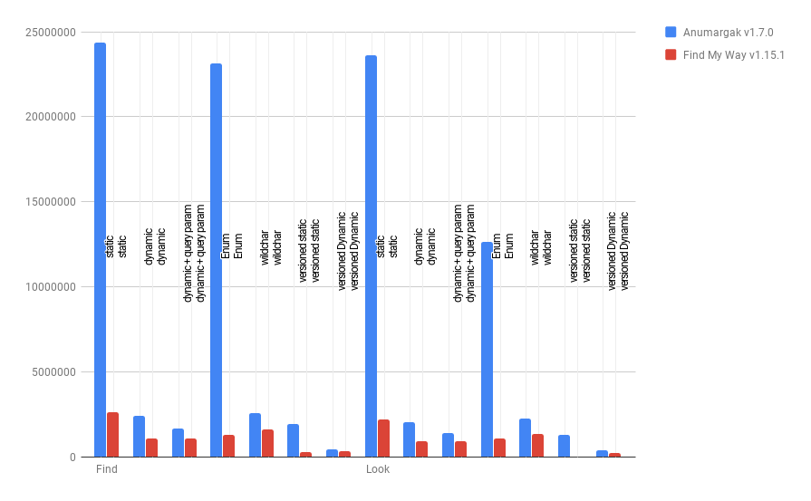

# अनुमार्गक (anumargak)
Fastest HTTP Router

<div align="center"></div>

[](https://snyk.io/test/github/naturalintelligence/anumargak) 
[](https://travis-ci.org/NaturalIntelligence/anumargak) 
[](https://coveralls.io/github/NaturalIntelligence/anumargak?branch=master) 
[](https://www.bithound.io/github/NaturalIntelligence/anumargak) 
[](https://npm.im/anumargak)


<a href="https://www.patreon.com/bePatron?u=9531404" data-patreon-widget-type="become-patron-button"></a>
<a href="https://www.paypal.com/cgi-bin/webscr?cmd=_s-xclick&hosted_button_id=KQJAX48SPUKNC"> </a>

## Features

* Fastest node js router (as far as Google & I know)
* Framework independent
* Supports static and  dynamic both type of URLs
* Supports path parameter with defined type `\this\is\:num([0-9]+)`
* Support multiple path parameters
* Handles enumerated URLs `\login\as\:role(admin|staff|user)`
* Supports wildchar `\this\is\*`, `\this\is\wild*`
* You nee not to register 2 separate routes for trailing slash. `\like\me\` and `\like\me`.
* Capture parameters' value for dynamic URLs.
* Warn (by default) or silently overwrites (when `overwriteAllow : true`) same or similar URLs
  * `\this\is\static` and `\this\is\static`
  * `\this\:param\is\dynamic` and `\this\param\:is\dynamic`
  * `\this\is\:uid([a-zA-Z0-9]+)` and `\this\is\:num([0-9]+)`
* Add similar but not same URLs
  * `\this\is\:age([0-9]+)` and `\this\is\:name([a-zA-Z]+)`
* Support of shorthand methods
* You can always have a count on registered routes

## Usage

```js
const router = require('anumargak')({
  defaultRoute : defaultHandler,
  ignoreTrailingSlash: true,
  ignoreLeadingSlash: true,
  overwriteAllow : true
});

anumargak.on("GET", "/this/is/static", handler);
anumargak.on(["POST","PUT"], "/this/is/static", handler);//supports array
anumargak.on("GET", "/this/is/:dynamic", handler);
anumargak.on("GET", "/this/is/:dynamic", handler);//it will overwrite old mapping
anumargak.on("GET", "/this/is/:dynamic/with/:pattern(\\d+)", handler);
//Eg: params = { dynamic : val, pattern: 123}
anumargak.on("GET", "/this/is/:dynamic/with/:two-:params", handler);//use - to separate multiple parameters
anumargak.on("GET", "/this/is/:dynamic/with/:two(\\d+):params", handler);
anumargak.on("GET", "/this/is/:dynamic/with/:two(\\d+)rest", handler);
anumargak.on("GET", "/similar/:string([a-z]{10})", handler);
anumargak.on("GET", "/similar/:number([0-9]{10})", handler);//above route is different from this


anumargak.find("GET","/this/is/static");//will return handler
anumargak.find("GET","/this/is/dynamic/with/123?ignore=me");//ignore query parameters and hashtag part automatically

anumargak.lookup(req,res) ;//will execute handler with req,res and params(for dynamic URLs) as method parameters

console.log(anumargak.count); //Print number of unique routes added
```

Example with server
```js
const http = require('http')
const router = require('anumargak')()

router.on('GET', '/', (req, res, params) => {
  //process the request response here
})

const server = http.createServer((req, res) => {
  router.lookup(req, res)
})

server.listen(3000, err => {
  if (err) throw err
  console.log('Server listening on: http://localost:3000')
})

```

**wildcard**: wild cards are helpful when a route handler wants to control all the underlying paths. Eg. a handler registered with `/help*` may take care of all the help pages and static resources under the same path.

```js
//this/is/juglee/and/
//this/is/juglee/and/wild
//this/is/juglee/and/wild/and/unknown
anumargak.on("GET", "/this/is/:dynamic/and/*", handler);

//this/is/juglee/and/wild
//this/is/juglee/and/wildlife
//this/is/juglee/and/wild/and/unknown
anumargak.on("GET", "/this/is/:dynamic/and/wild*", handler);
```

**shorthand methods**

```js
var router = Anumargak();

router.get("/this/is/:dynamic", () => 30);
router.head("/this/is/:dynamic", () => 30);
router.post("/this/is/:dynamic", () => 30);
router.put("/this/is/:dynamic", () => 30);
router.delete("/this/is/:dynamic", () => 30);
```

## Similar but not same URLs

```js
const anumargak = require('anumargak')()
//this/is/my/75
anumargak.on("GET", "/this/is/my/:age([0-9]{2,3})", handler);

//this/is/my/amit
anumargak.on("GET", "/this/is/my/:name([a-zA-z]+)", handler);
```

## Named Expressions

Anumargak lets you add named expressions. You can use them at the time of registering the route.

```js

router.addNamedExpression("num","\\d+");
router.addNamedExpression({
   "name1" : "regx1",
   "name2" : "regx2",
});

```

Example routes

```js
/send/to/:phone(:phone:)
/authenticate/:token(:alphanum:)
```

Adding them make this router simple to use.


## Benchmark
|method | url type  | anumargak (अनुमार्गक) | find-my-way|
|------|------|------|------|
| find | static | 27445088.79 | 3130047.682 |
| find | dynamic | 2677420.545 | 1243596.976 |
| find | dynamic with query | 1735442.647 | 1225523.327 |
| find | enum | 25881565.6 | 1416613.461 |
| lookup | static | 29077013.86 | 2400789.425 |
| lookup | dynamic | 2030403.951 | 1101769.543 |
| lookup | dynamic with query | 1419140.375 | 974787.2642 |
| lookup | enum | 15906062.45 | 1191961.68 |

*Note* : Above benchmark has been taken on 16gb RAM ubuntu 17.10 machine with node v9.5.0 and npm v5.6.0





### Worth to mention

- **[NIMN निम्न](https://github.com/nimndata/spec)** : Schema aware object compression. 60% more compressed than JSON. 40% more compressed than msgpack.
- **[imglab](https://github.com/NaturalIntelligence/imglab)** : Web based tool to label images for object detection. Use it to train dlib or other object detectors. Integrated with 3rd party libraries to speed up tp process and to make you lazy.
- [fast-lorem-ipsum](https://github.com/amitguptagwl/fast-lorem-ipsum) : Generate lorem ipsum words, sentences, paragraph very quickly. Pure JS implementation.
- [stubmatic](https://github.com/NaturalIntelligence/Stubmatic) : A stub server to mock behaviour of HTTP(s) / REST / SOAP services. You can easily mock msgpack, and nimn data formats as well.
- [fast-xml-parser](https://github.com/NaturalIntelligence/fast-xml-parser/) : Pure JS implementation to parse XML to JSON, JS Object, or Nimn format. Parse back from JSON, JS Object to XML. Or just validate XML syntax.
- [Grapes](https://github.com/amitguptagwl/grapes) : Flexible Regular expression engine (for java) which can be applied on char stream. (under development)
- [Muneem (मुनीम)](https://github.com/muneem4node/muneem): A framework to write fast web services in easy way. Designed specially for developers, QAs, Maintainers, and BAs.


## Contributors
-  [amitguptagwl](https://github.com/amitguptagwl)
-  [rajeshdh](https://github.com/rajeshdh)
-  [shuklajay117](https://github.com/shuklajay117)
